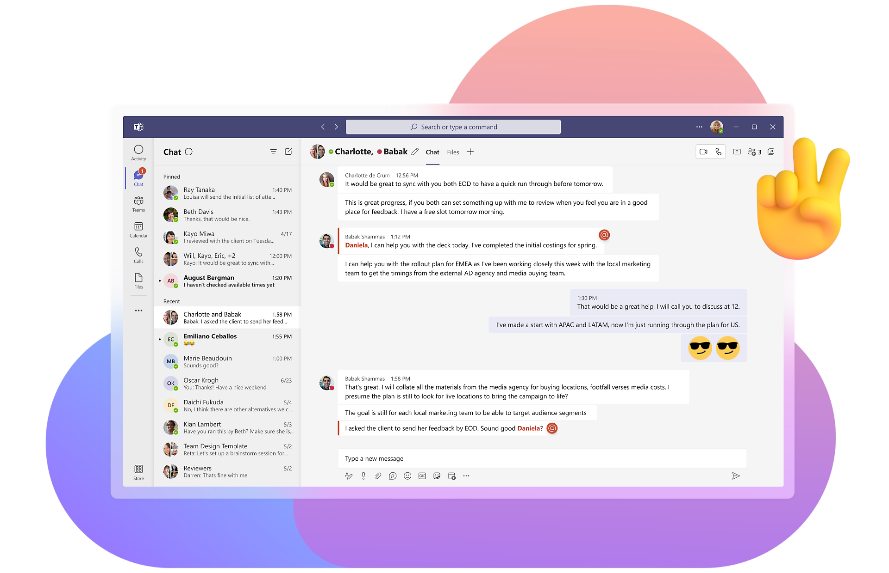
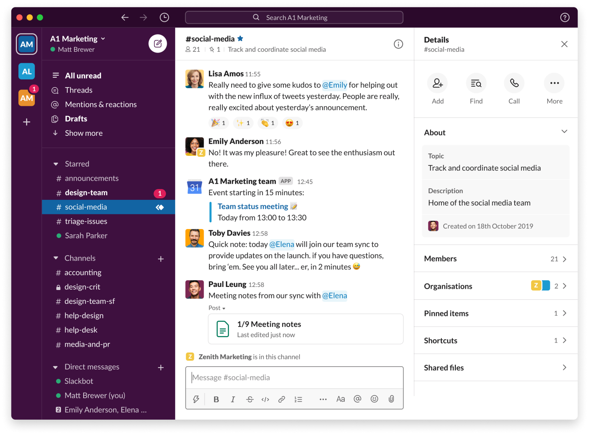
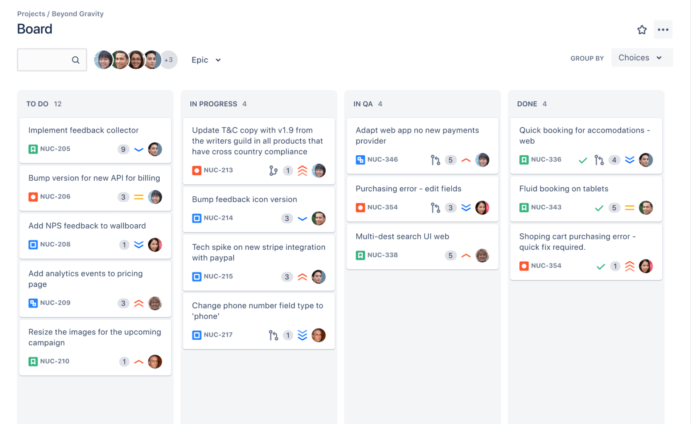
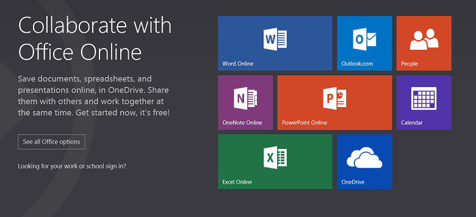
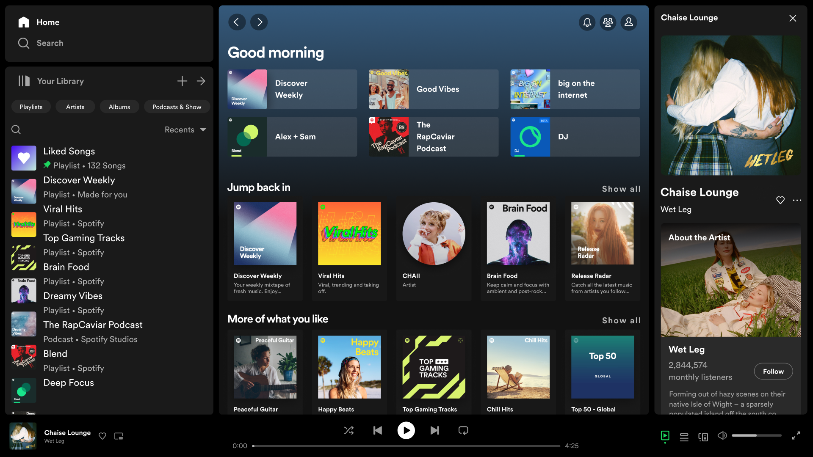
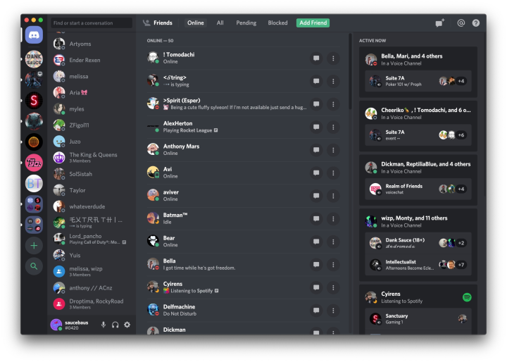
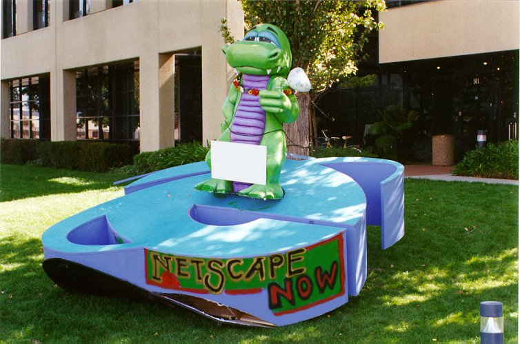
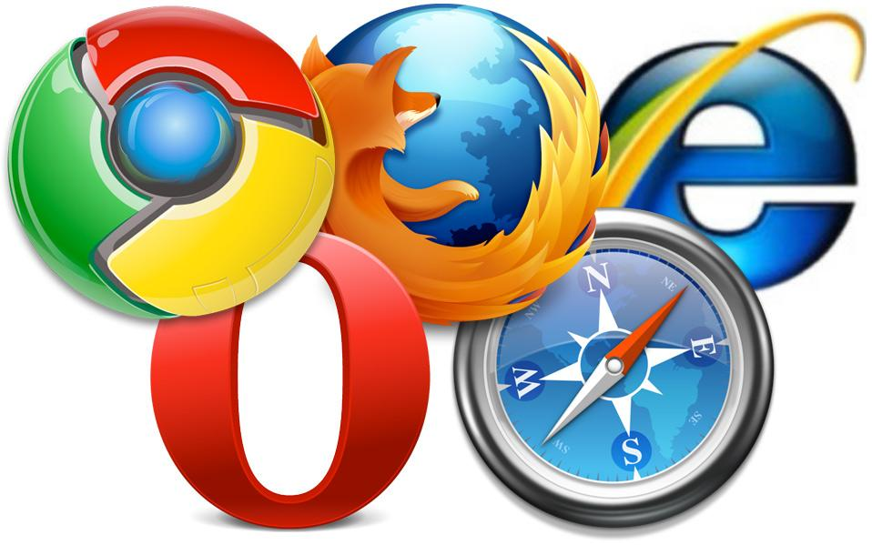

# The Anatomy of a WebApp

<h2 data-marpit-fragment="2">From code to browser.</h2>

<!-- Welcome! Short intro into story. -->

---

# Think about the apps you use daily
<!-- WebApps are everywhere. Your favorite app possibly is one. -->
<!-- What do you use daily, in your work? Or privately? How much time do you spend in these apps?-->

----

 <!-- Story mode - I start my day, fire up my Teams, check my email (Gmail/Outlook), turn on some music (Spotify), maybe get to work using Google Docs or Microsoft Word online. In the afternoon I might look at a tutorial on YouTube, and in the evening I fire up Discord to talk with friends or watch a movie on Netflix. -->

<!-- (Joke) although Teams is probably nobody's favorite app. -->

----

----

----

----

 

----

<!-- These are all webapps.-->
# These are all WebApps

<!-- Although alot of these have native apps on most platforms, they all have their basis as a WebApp. -->

----

# The Anatomy of a WebApp
## From code to browser

---

<!--  -->

<h2 class="center">Bjorn Schijff</h2>

Sr. Frontend Engineer / Software Architect / Speaker & Trainer

@ Codestar by Sopra Steria

---

<h1 class="center">Act I.</h1>

<h1 class="slide-up">What's a WebApp</h1>

* Application ran in the browser
* No installation of software
* Offer an interactive user experience*

<!-- No installation: Besides the occasional "Accept", no installation of any sorts required on your machine. -->
<!-- Interactive UX: vs. a static page with just content like a blog or news site. -->

---

# History of WebApps

----

# Late 90s

<!--  -->

----

----

# Early 00s

<!-- Introduction of the 'first' WebApp - Gmail. BEFORE JQUERY! -->

----

<!-- Remember 1GB being a lot? Remember needing an invite? -->
<!-- But remember Hotmail as a comparison? It was SSR, but nothing interactive. Every click was a new page. -->

----

<!-- Introduction of JQuery (2006), opening the door to more interactive webpages. Lot's of complicated JavaScript things became easy to do all of a sudden, including "AJAX" (Asynchronous JavaScript & XML, retrieving data.) -->

----

<!-- The start of the frameworks, interactivity on the web is normalizing, it becomes easier to create interactive pages and "apps". AngularJS (2010), ReactJS (2013) -->

----

// Summarization slide with all logo's of modern stacks
// Enabling the development of webapps all over, but we'll dive into that later.

----

## Blogpost

<!-- Want to read more? Some geezer wrote an article about it. -->
<!-- Conclusion and summary; webapps have gotten more popular in the last 10-15 years as it became easier to move interactivity to the frontend, making the client-side more in the lead about where logic and data would live. -->

---

<h1 class="center">Act II.</h1>

<h1 class="slide-up">Browser</h1>

<!-- 1. History of the browser, introduction of JavaScript -->

----

<!--  -->

First browser war (1995-2001)

<!-- The first browser war, (1995-2001), IE vs. Netscape -->

----

Second browser war (2004-2017)

----

// Bit of a better flow? Perhaps HTML and then the ES part on a separate slide?

HTML5 (2008), CSS3 (2011)

JavaScript (1995)
ECMAScript (1997)
ES5 (2009)
ES6 (2016)

<!-- // History, quick summary of years of introduction of ECMAScript, which browsers etc? -->
<!-- // End with the point where most browsers got kinda caught up and online capabilitites for apps become mainstream/normalized. -->

----

## Side-quest

Electron & Tauri logo's

<!-- 1a. Electron? Tauri?  -->
<!-- // Clear distinction between webapps and native apps, where some (not all) share a codebase. Slack, Discord, etc. have native apps that run the webapp internally. Gmail is mainly a web version only, Microsoft Teams and Netflix are probably a bit more complicated. -->

---

// The browsers's "job"
// Flow image -> Address, HTTP, retrieve, parse, download assets, render, etc.
<!-- 2. The flow from browser to server, Nginx/Apache or what have you, downloads the files -->

---

// Show Inspect F12 tab downloads of HTML, CSS, images, and JS --> Leading into next one.
<!-- 3. JavaScript runs the application, under the hood check, it's all HTML, CSS and JS! -->

---

// Show Minified/compressed Javascript, make it hard to read and understand.
<!-- Last slide: But, the JavaScript you receive is not the code you write? Let's dive into that! 
// Screenshot of obfuscated code in the browser? -->

---

<h1 class="center">Act III.</h1>

# Code
<!-- 1. Modern web app tooling, SPA's, meta-frameworks for hybrids -->
<!-- 2. Building, compilation, webpack/vite/esbuild/tsc, including optimalisation and obfuscation/minimizing -->
<!-- 3. Deployment to a server (Act 2) -->
<!-- 4. Lift off! -->

---

Fin.

// Thank you slide, QR code, reiterate contact info.