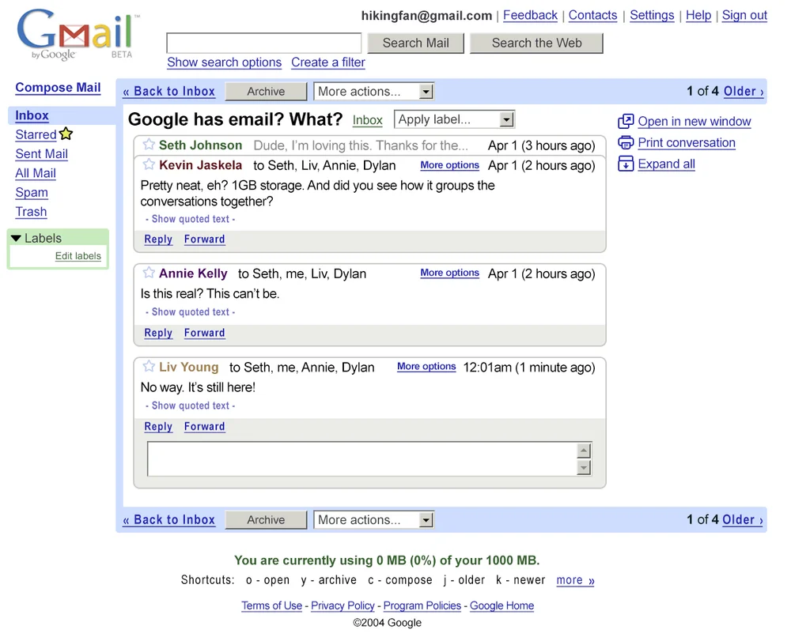
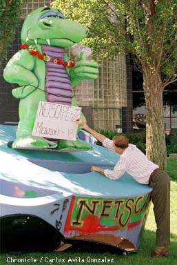
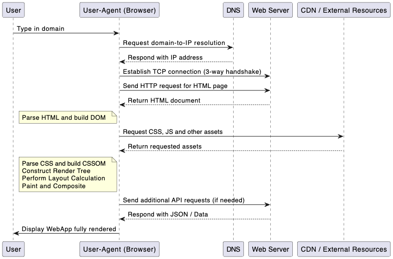
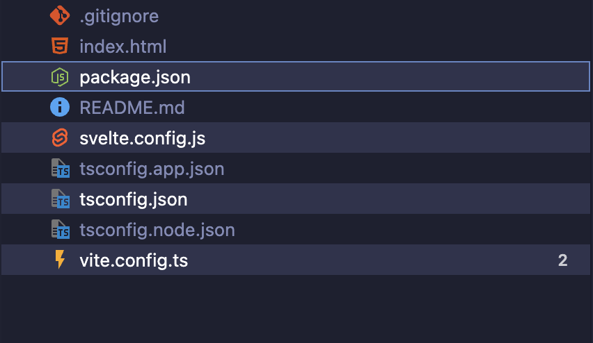
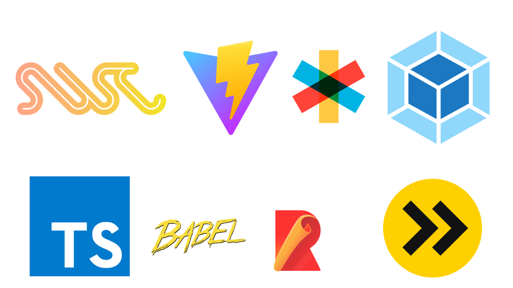
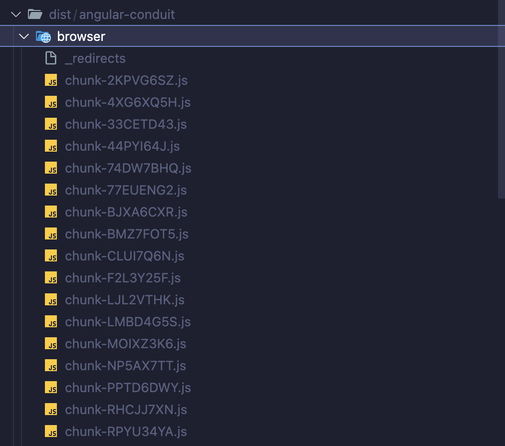

# The Anatomy of a WebApp

<h2 data-marpit-fragment="2">From code to browser.</h2>

<!-- Welcome! Short intro into story about apps used daily. -->

---

# Think about the apps you use daily
<!-- WebApps are everywhere. Your favorite app possibly is one. -->
<!-- What do you use daily, in your work? Or privately? How much time do you spend in these apps?-->

----

 <!-- Story mode - I start my day, fire up my Teams, check my email (Gmail/Outlook), turn on some music (Spotify), maybe get to work using Google Docs or Microsoft Word online. In the afternoon I might look at a tutorial on YouTube, and in the evening I fire up Discord to talk with friends or watch a movie on Netflix. -->


<!-- (Joke) although Teams is probably nobody's favorite app. -->

----


----


----


----

<div style="display: flex;">


 

</div>

<!-- Later in the day, some music, check in with friends all over the world on discord, or end it with a movie on Netflix. -->

----

<!-- These are all webapps.-->
# These are all WebApps

<!-- Although alot of these have native apps on most platforms, they all have their basis as a WebApp. -->

----

# The Anatomy of a WebApp
## From code to browser

<!-- For the next 25-30 minutes, we'll dive into the anatomy of a webapp. -->

---

<!--  -->


<h2 class="center">Bjorn Schijff</h2>
<p class="center muted">Sr. Frontend Engineer / Software Architect / Speaker & Trainer</p>
<p class="center">@ Codestar by Sopra Steria

---

<h1 class="center">Act I.</h1>

<div data-marpit-fragment>

<h1 class="slide-up">What's a WebApp</h1>

</div>

* Application ran in the browser
* No installation of software
* Offer an interactive user experience*

<!-- No installation: Besides the occasional "Accept", no installation of any sorts required on your machine. -->
<!-- Interactive UX: vs. a static page with just content like a blog or news site. -->

<!-- This definition is a bit... simple. So hopefully after todays talk we'll get a better idea of what really makes up a webapp.-->

---

# History of WebApps

<!-- To understand how we got here, let's first go into some history. -->

----

# Late 90s

<div data-marpit-fragment>


</div>

<!--  Not really interactive, but there was not really any "interactivity" on the web back then. -->

----


<!-- Dominated by Server Side solutions for the web; templating languages for dynamic content.-->


----

# Early 00s

<!-- Introduction of the 'first' WebApp, does any one know? -->

----




<!-- 1st of April, 2004. Fully interactive page, where the folders on the left of the clicking of an email wouldn't rerender your whole page; but update it in place. Revolutionary! In comparison back then to things like Hotmail. -->

----


<!-- Introduction of JQuery (2006), opening the door to more interactive webpages. Lot's of complicated JavaScript things became easy to do all of a sudden, including "AJAX" (Asynchronous JavaScript & XML, retrieving data.) -->

----


<!-- The start of the frameworks, interactivity on the web is normalizing, it becomes easier to create interactive pages and "apps". AngularJS (2010), ReactJS (2013) -->

----


<!-- Enabling the development of webapps all over, making it easier for developers to build. -->

----

## Blogpost


<!-- Want to read more? Some geezer wrote an article about it. -->
<!-- Conclusion and summary; webapps have gotten more popular in the last 10-15 years as it became easier to move interactivity to the frontend, making the client-side more in the lead about where logic and data would live. -->

---

<h1 class="center">Act II.</h1>

<div data-marpit-fragment>

<h1 class="slide-up">Browser</h1>

</div>

<!-- 1. History of the browser, introduction of JavaScript -->

----

<!--  -->


First browser war (1995-2001)

<!-- The first browser war, (1995-2001), IE vs. Netscape -->

----


Second browser war (2004-2017)

<!-- Debate if it ended in 2014, wiki says 2017. Chrome the clear winner. -->
<!-- But why do we talk about the history of it? To see what that competition has given us for technologies that enable webapps. -->

----


* HTML5 (2008)
* CSS3 (2011)

* JavaScript (1995)
* ECMAScript (1997)
* ES5 (2009)
* ES6 (2016)

<!-- HTML5 for modern syntax that helped browsers, CSS3 for modern styling and layout possibilities to deal with different screen sizes (mobile problem too!) -->
<!-- JS by Netscape, into Ecma International Standard, turned into modern ES used everywhere. -->
<!-- End with the point where most browsers got kinda caught up and online capabilitites for apps become mainstream/normalized. -->

----

## Side-quest


<!-- 1a. Electron, Tauri, Flutter, etc. making it easy to deploy webapps as a desktop/mobile app. Not the main scope of today. -->
<!-- Clear distinction between webapps and native apps, where some (not all) share a codebase. Slack, Discord, etc. have native apps that run the webapp internally. Gmail is mainly a web version only, Microsoft Teams and Netflix are probably a bit more complicated. -->

---


<!-- Flow image -> Address, HTTP, retrieve, parse, download assets, render, etc. -->
<!-- 2. The flow from browser to server, Nginx/Apache or what have you, downloads the files -->

----


<!-- Webservers? Nginx / Apache / CDNs (S3/Minio etc.) -->
<!-- In the end it's just HTML, CSS, JavaScript and other assets like images, being downloaded by a browser. -->

----


<!-- So in the end our browser (our native app that emulates a browser) will reach out to a web server or CDN, download a HTML page and additional assets, and starts up the client side "WebApp" -->

----


<!-- Show Inspect F12 tab downloads of HTML, CSS, images, and JS. Leading into next one. -->
<!-- JavaScript runs the application, under the hood: it's all HTML, CSS and JS! -->

---


<!-- Last slide: But, the JavaScript you receive is not the code you write?  This has hints of React, but this is not the sort of code I can read. Let alone the organization and architecture of files and folders that makes it easy to work with... 

Let's dive into that!
-->

---

<h1 class="center">Act III.</h1>


<div data-marpit-fragment>

<h1 class="slide-up">Code</h1>

</div>

<!-- So now that we've seen what role a browser plays for our WebApp, let's dive into the code that we need to run on our users devices. -->

---


<!-- So how do we go from a (very) cleanly generated repository (using your favorite stack) ... -->

---

<!-- // TODO Maybe improve image? -->

<!-- ...to this fully build application? -->

---


<!-- This talk is not meant to go into the workings of any modern stacks. If inspired, take any one that interests you and follow a tutorial! But if you start with any stack like this, you'll probably end up with some form of configuration for the tools it uses under the hood...-->

---




<!-- Which will have any combination of these kinds of files... Let's dive into what these represent and what they do. -->

---


<!-- Example of what webpack describes itself as. -->

---



<!-- SWC: Speedy web compiler, Vite, Terser, Webpack, TSC, Babel, Rollup, esbuild -->

<!-- Most stacks use one or more of these tools in different combinations. Some are opt-in by plugins, some are default, but they all have some overlap in functions. -->

---

# Build steps

* Compilation & Transpilation
* Tree-shaking
* Minification & Optimization
* Code-splitting
* Bundling

<!-- Although the exact order might differ a bit on the used set of tools, as they have some overlap. But at some point in the build process; they'll have to do something like this. -->

---

# Compilation & Transpilation

<small>TSC, Babel, SWC</small>


<!-- SWC, TSC, esbuild (etc.) will take our TypeScript files and convert them to the requested target of JavaScript. esnext or others; depending on the level of compatibility you want to offer to older browsers. -->

---

# Tree-shaking

<small>Webpack, Rollup, esbuild, Vite</small>

```ts
import { usedFunction, unusedFunction } from './utils';
import { of } from 'rxjs';

usedFunction();
const stream = of([1,2,3]);
```

<!-- Only take into consideration code that's actually used. This goes both for our application (eliminate testing code for example!), and libraries that we only need a part off. Less JavaScript is better! -->

---

# Minification & Optimization

<small>Terser, esbuild, UglifyJS</small>


<!-- Take the compiled / optimized JavaScript and remove whitespaces, optimize variable names, use shorter ways to write certain code (based on the requested target, depends on the target ES or platform) to make sure we have less kilobytes of JavaScript to ship. -->

---

# Code-splitting

<small>Webpack, Rollup, Vite</small>


<!-- Enables lazy-loading. The build system figures out the absolute minimum amount of JavaScript to ship to the browser to be able to start the application. Then it bundles and chunks pieces of code that needs to be shipped together for additional on-demand features. -->


---

# Bundling


<!--  -->

<!-- The final bundling then renames and optimizes all the identified chunks, brings all the work done in memory back to real files and outputs the build artifact as a folder that can be deployed. -->
<!-- Kinda depends on the tools and stack you're using, it kinda defines what's minimally required to run and how it handles lazy loading. -->

---

# Serving final artifact


<!-- When you deploy this to your Web Server or CDN and make it available on the internet: This will be the end product of all our hard work.  -->

---

# Summary

* WebApps are everywhere. Your favorite daily app might be one!
* Code runs everywhere, the browsers do the heavy lifting
* It's all HTML, CSS and JavaScript.
* Ship minimal JavaScript, maximize interactivity

<div data-marpit-fragment>

<h2 class="slide-up">Create true app-like experiences for the web.</h2>

</div>

<!-- To summarize: We write for the browser, not the server. This means that our code runs *everywhere*. On your phones and laptops, everywhere you have a browser (or an application imitating a browser). And our tools make it easy to develop, but we try to ship as little JavaScript as possible whilst making the apps as useful as possible. -->

<!-- So next time you open a webapp, you'll know exactly what’s happening under the hood. -->

---

#  Fin

<div data-marpit-fragment>


</div>
<div data-marpit-fragment>


<h2 class="center">Bjorn Schijff</h2>
<p class="center muted" style="line-height: 3rem; display: inline-block;">
     <span>bjeaurn.com</span>
     <span>@Bjeaurn</span>
</p>

</div>

<!-- So next time you open a webapp, you'll know exactly what’s happening under the hood. -->
<!-- Follow me anywhere with this alias, Github, Discord, Twitter, BlueSky, you name it... -->
